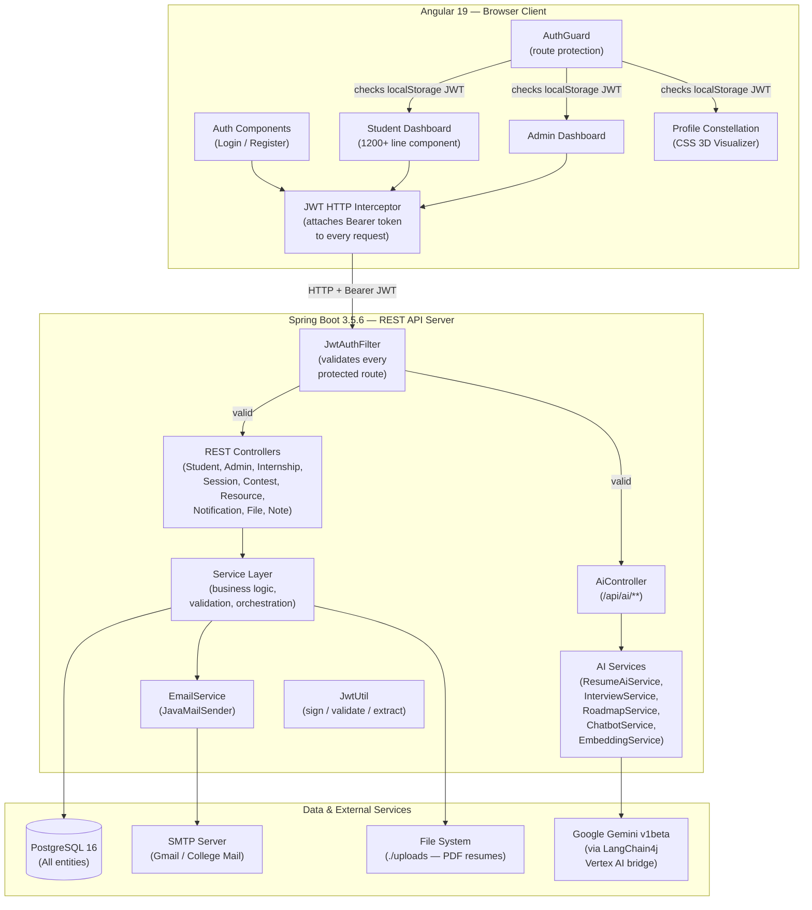
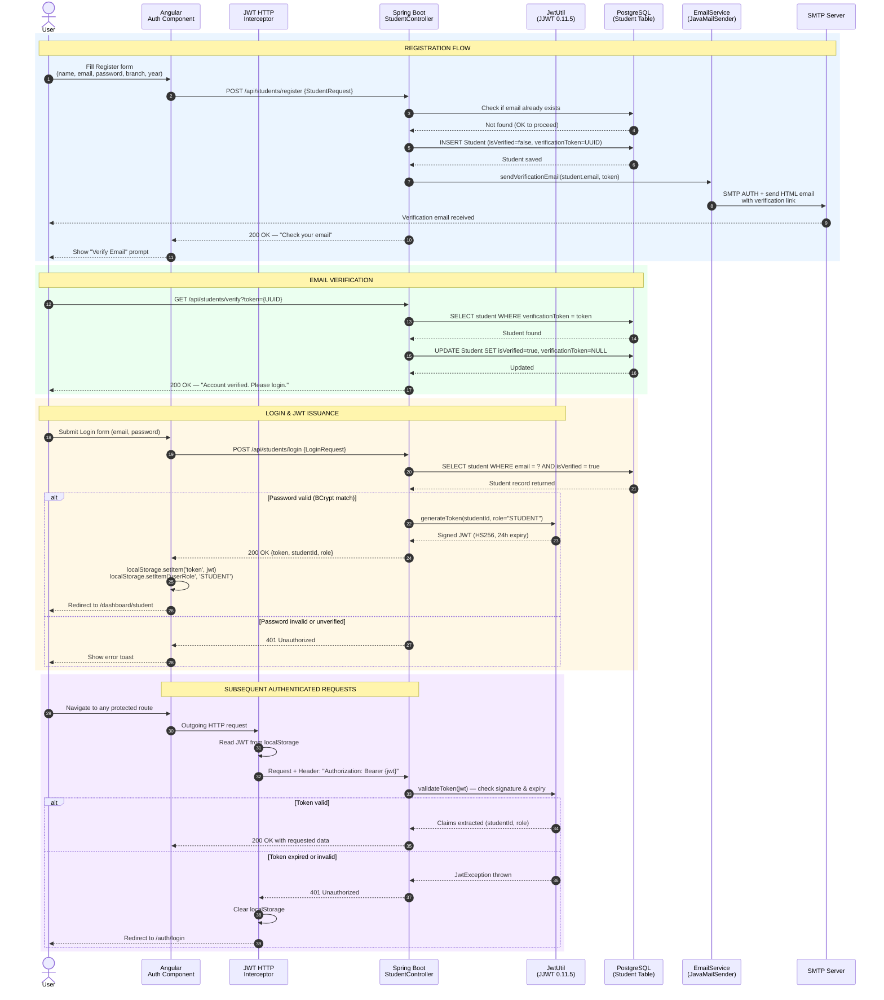
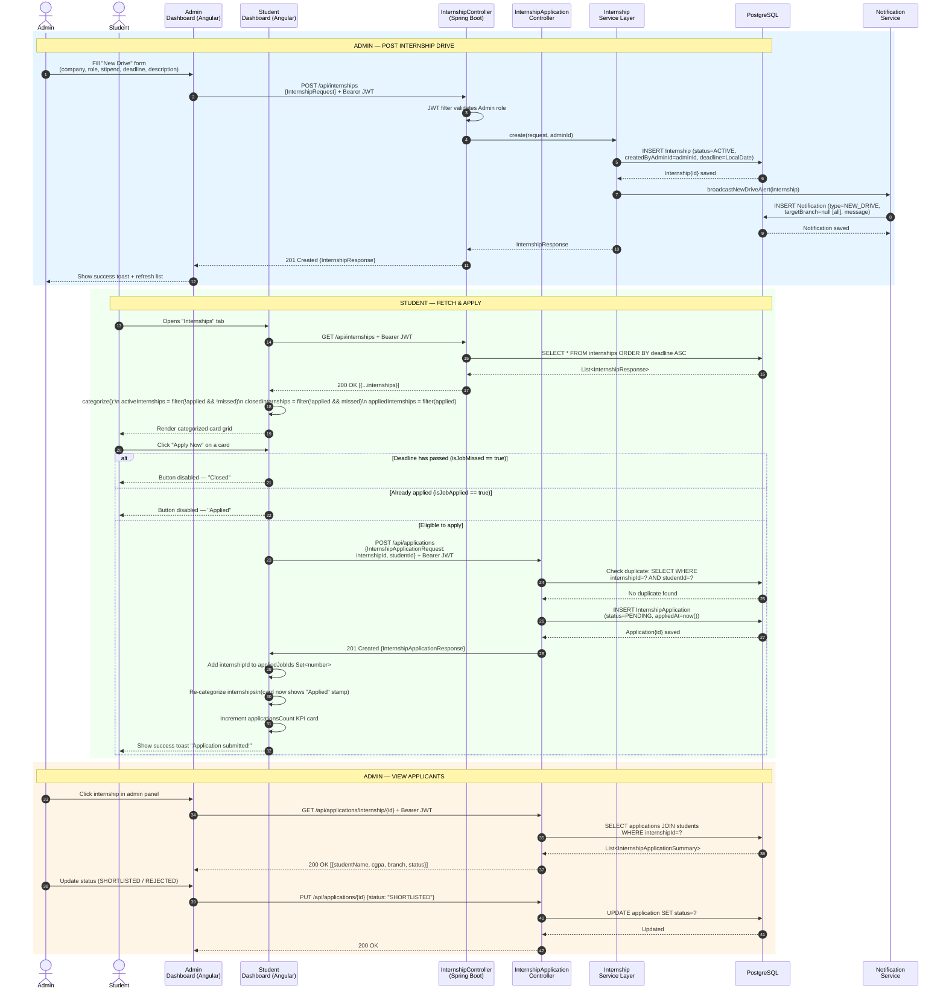
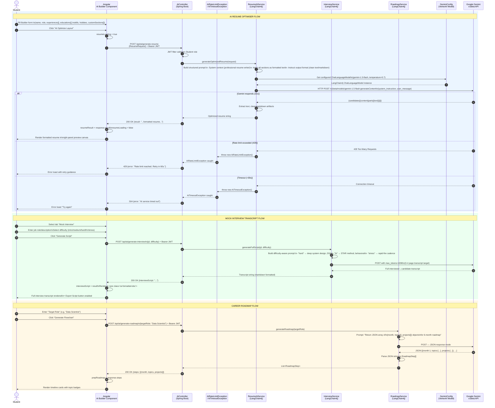
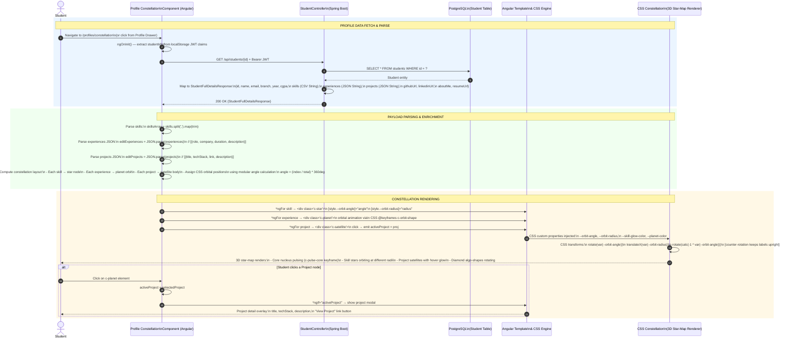
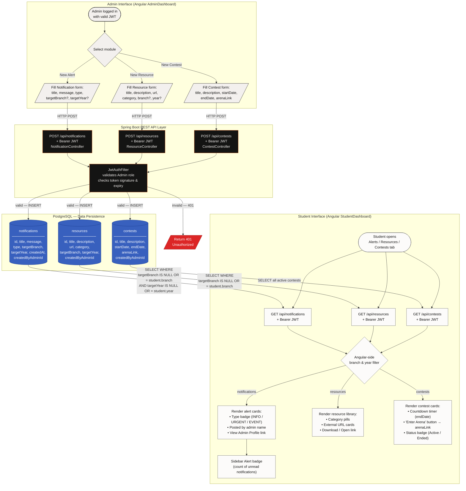

# TnP Connect — System Architecture

> This document contains enterprise-grade system design diagrams for every core workflow in TnP Connect.
> All diagrams are written in [Mermaid.js](https://mermaid.js.org/) and render natively on GitHub.

---

## Table of Contents

1. [High-Level Component Overview](#1-high-level-component-overview)
2. [Authentication & Security Flow](#2-authentication--security-flow)
3. [Internship & Sessions Dual-Role Workflow](#3-internship--sessions-dual-role-workflow)
4. [AI Intelligence Pipeline](#4-ai-intelligence-pipeline)
5. [Profile & Constellation Visualizer](#5-profile--constellation-visualizer)
6. [Global Modules — Contests, Resources, Alerts](#6-global-modules--contests-resources-alerts)

---

## 1. High-Level Component Overview

---

## 2. Authentication & Security Flow

This diagram covers the complete lifecycle: Registration with email verification through to JWT issuance and frontend interceptor attachment.

---

## 3. Internship & Sessions Dual-Role Workflow

This diagram covers both roles: Admin posting a drive, and a Student applying with deadline enforcement.

---

## 4. AI Intelligence Pipeline

This diagram covers the complete multi-tier AI flow through the Angular frontend, Spring Boot service layer, and Google Gemini via LangChain4j.

---

## 5. Profile & Constellation Visualizer

This diagram shows how the student's full profile is fetched, parsed, and injected into the Profile Constellation CSS 3D visualizer.

---

## 6. Global Modules — Contests, Resources, Alerts

This diagram shows the unified CRUD flow for broadcast modules: how Admins create content and how the Frontend filters and delivers it to specific student cohorts.

---

## Key Design Decisions

| Decision | Rationale |
|---|---|
| **JWT in localStorage** | Simple SPA-compatible storage; `AuthGuard` + `JwtInterceptor` handle automatic injection and expiry redirect |
| **LangChain4j over raw REST** | Provides structured output parsing, retry logic, and prompt templating out of the box, reducing boilerplate in AI service layer |
| **Experiences/Projects as JSON Strings in PostgreSQL** | Avoids complex relational modeling for variable-length arrays; parsed in-memory in Angular and Spring services |
| **Client-side PDF export (jsPDF + html2canvas)** | Zero server load; the HTML canvas captures the live preview exactly as styled and converts to PDF without a second render pass |
| **HTML5 native Drag-and-Drop** | No external DnD library dependency; `draggable="true"` with `(dragstart)`, `(dragover)`, `(drop)` handlers, array splice/insert on drop |
| **CSS Variables for theming** | All design tokens in `:host { --token: value }` allow instant Dark Mode via `:host-context(.dark-theme)` remapping — zero JavaScript for theme switching |

---

*Back to [README.md](README.md)*
