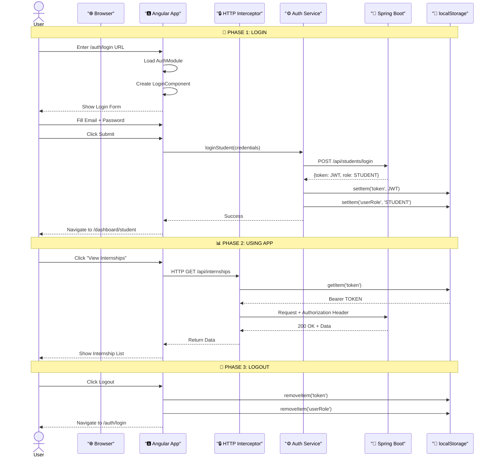
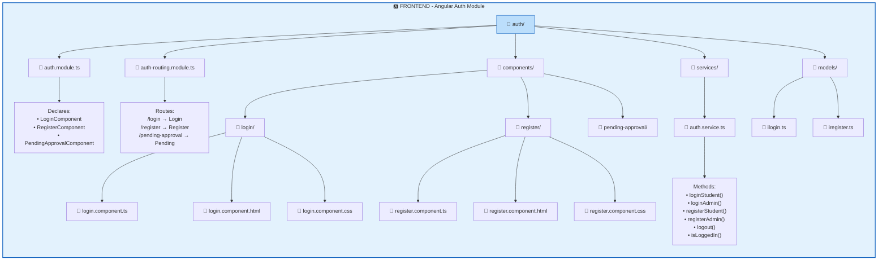
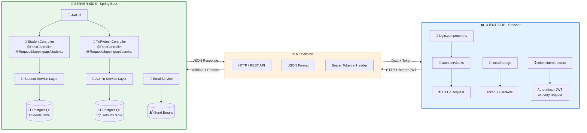
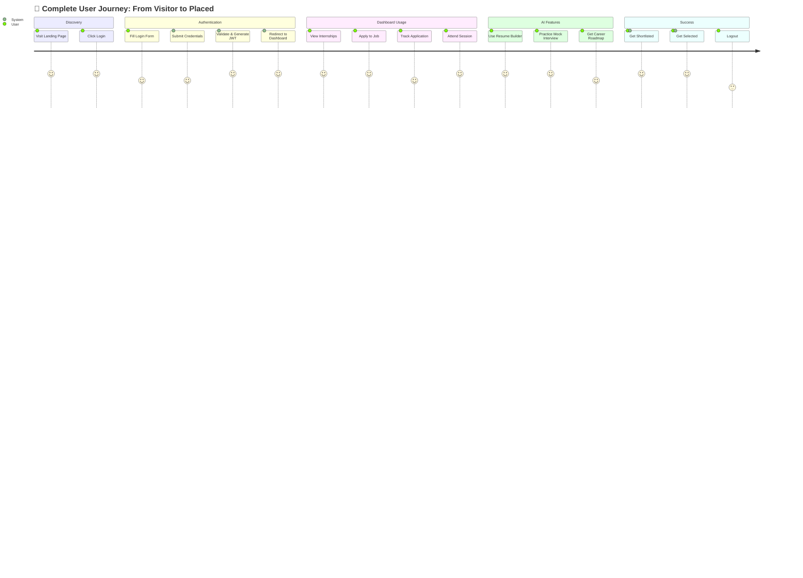

# Auth Module - Complete Mermaid Diagrams

> All flows in proper Mermaid syntax for PPT

---

## 1️⃣ LOGIN EXECUTION FLOW

```mermaid
flowchart TD
    A[👤 User Fills Form<br/>Email + Password] --> B[Click Submit]
    B --> C{Form Valid?}
    C -->|No| D[Show Validation Errors]
    C -->|Yes| E[🅰️ Login Component<br/>onSubmit()]
    
    E --> F{Which Tab?}
    F -->|Student| G[authService.loginStudent()]
    F -->|Admin| H[authService.loginAdmin()]
    
    G --> I[🌱 Backend<br/>POST /api/students/login]
    H --> J[🌱 Backend<br/>POST /api/admins/login]
    
    I --> K{Credentials Valid?}
    J --> L{Approved Status?}
    
    K -->|No| M[❌ Error Message<br/>Invalid Credentials]
    L -->|Pending| N[❌ Error Message<br/>Account Pending Approval]
    
    K -->|Yes| O[✅ Generate JWT Token<br/>{id, role, email, expiry}]
    L -->|Approved + Valid| O
    
    O --> P[📤 Return Response<br/>{token, role, id}]
    P --> Q[🅰️ tap() Operator]
    
    Q --> R[💾 localStorage.setItem<br/>'token' + 'userRole']
    R --> S[✅ Login Success]
    
    S --> T{Role?}
    T -->|Student| U[Navigate to<br/>/dashboard/student]
    T -->|Admin| V[Navigate to<br/>/dashboard/admin]
    
    M --> W[Stay on Login Page]
    N --> W
    D --> W
    
    style A fill:#e3f2fd,stroke:#1565c0
    style O fill:#c8e6c9,stroke:#2e7d32
    style M fill:#ffcdd2,stroke:#c62828
    style N fill:#ffcdd2,stroke:#c62828
    style U fill:#e8f5e9,stroke:#2e7d32
    style V fill:#e8f5e9,stroke:#2e7d32
```

---

## 2️⃣ REGISTER EXECUTION FLOW

```mermaid
flowchart TD
    A[👤 User Selects Tab<br/>Student or Admin] --> B[Fill Registration Form]
    B --> C[Click Register]
    C --> D{Form Valid?}
    
    D -->|No| E[Show Validation Errors<br/>Mark fields touched]
    D -->|Yes| F[🅰️ Register Component<br/>onSubmit()]
    
    F --> G{Active Tab?}
    G -->|Student| H[authService.registerStudent()]
    G -->|Admin| I[authService.registerAdmin()]
    
    H --> J[🌱 POST /api/students/]
    I --> K[🌱 POST /api/admins/register]
    
    J --> L{Email Exists?}
    K --> M{Email Exists?}
    
    L -->|Yes| N[❌ Error<br/>Email already in use]
    M -->|Yes| N
    
    L -->|No| O[✅ Save to Database]
    M -->|No| P[✅ Save to Database<br/>Status: PENDING]
    
    O --> Q[📧 Send Verification Email]
    P --> R[📧 Notify Super Admin]
    
    Q --> S{Which Flow?}
    S -->|Student| T[✅ Registration Success]
    S -->|Admin| U[⏳ Pending Approval]
    
    T --> V[Navigate to /auth/login<br/>?registered=true]
    U --> W[Navigate to /auth/pending-approval]
    
    N --> X[Stay on Register Page]
    E --> X
    
    style O fill:#c8e6c9,stroke:#2e7d32
    style P fill:#fff3e0,stroke:#ef6c00
    style T fill:#c8e6c9,stroke:#2e7d32
    style U fill:#fff3e0,stroke:#ef6c00
    style N fill:#ffcdd2,stroke:#c62828
```

---

## 3️⃣ COMPLETE USER FLOW: Login + Dashboard + Logout



---

## 4️⃣ FRONTEND FILE STRUCTURE (Auth Module)



---

## 5️⃣ BACKEND FILE STRUCTURE (Auth Controllers)

```mermaid
graph TB
    subgraph BACKEND["🌱 BACKEND - Spring Boot Auth Layer"]
        direction TB
        
        A[📁 com.fsd_CSE.TnP_Connect/] --> B[📁 controllers/]
        A --> C[📁 services/]
        A --> D[📁 entities/]
        A --> E[📁 repositories/]
        A --> F[📁 util/]
        
        B --> B1[📄 StudentController.java]
        B --> B2[📄 TnPAdminController.java]
        
        B1 --> B1A["Endpoints:<br/>POST /api/students/<br/>POST /api/students/login<br/>PATCH /api/students/{id}<br/>GET /api/students/{id}/full-details"]
        
        B2 --> B2A["Endpoints:<br/>POST /api/admins/register<br/>POST /api/admins/login<br/>PATCH /api/admins/{id}/approve<br/>GET /api/admins/pending-requests"]
        
        C --> C1[📄 EmailService.java]
        
        D --> D1[📄 Student.java
        @Entity
        Table: students]
        D --> D2[📄 TnPAdmin.java
        @Entity
        Table: tnp_admins]
        
        E --> E1[📄 StudentRepository.java]
        E --> E2[📄 TnPAdminRepository.java]
        
        F --> F1[📄 JwtUtil.java
        • generateToken()<br/>• validateToken()<br/>• extractClaims()]
    end
    
    style BACKEND fill:#e8f5e9,stroke:#2e7d32,stroke-width:2px
    style A fill:#c8e6c9,stroke:#2e7d32
```

---

## 6️⃣ COMPLETE ARCHITECTURE: Frontend ↔ Backend



---

## 7️⃣ JWT TOKEN LIFECYCLE

```mermaid
stateDiagram-v2
    [*] --> LoginPage: User visits /auth/login
    
    LoginPage --> Validating: Submit Credentials
    Validating --> ErrorState: Invalid Credentials
    Validating --> TokenGenerated: Login Success
    
    ErrorState --> LoginPage: Show Error Message
    
    TokenGenerated --> Storage: Save to localStorage
    
    Storage --> Authenticated: Every API Call
    
    Authenticated --> ValidatingToken: Interceptor attaches token
    
    ValidatingToken --> APIAllowed: Token Valid
    ValidatingToken --> Expired: Token Expired
    
    APIAllowed --> Dashboard: Access Granted
    
    Expired --> LoginPage: Clear Storage
    Expired --> Redirect: Redirect to Login
    
    Dashboard --> Logout: User Clicks Logout
    
    Logout --> StorageCleared: Remove token
    StorageCleared --> LoginPage: Navigate to /auth/login
    
    TokenGenerated: 🎫 JWT Generated
    • Contains: id, role, email
    • Signed with HS256
    • Expires in 24 hours
    
    Storage: 💾 localStorage
    • token: eyJhbG...
    • userRole: STUDENT/ADMIN
    
    Authenticated: 🔓 Authenticated State
    • Can access protected routes
    • Auto-token attachment
    • Can logout anytime
```

---

## 8️⃣ COMPLETE USER JOURNEY MAP



---

## 🎯 QUICK REFERENCE: Which Diagram for Which Slide

| Use Case | Diagram | Lines |
|----------|---------|-------|
| Explain Login Flow | **#1 Login Execution Flow** | 1-50 |
| Explain Register Flow | **#2 Register Execution Flow** | 52-100 |
| Show Full User Session | **#3 Complete User Flow** | 102-150 |
| Frontend Architecture | **#4 Frontend File Structure** | 152-200 |
| Backend Architecture | **#5 Backend File Structure** | 202-250 |
| Full System Overview | **#6 Complete Architecture** | 252-300 |
| Security Explanation | **#7 JWT Token Lifecycle** | 302-350 |
| User Experience | **#8 User Journey Map** | 352-380 |

---

## 💡 PPT SLIDE LAYOUT SUGGESTION

### Single Comprehensive Auth Slide:

```
┌─────────────────────────────────────────────────────────────┐
│              🔐 AUTHENTICATION SYSTEM COMPLETE              │
├─────────────────────────────────────────────────────────────┤
│                                                             │
│  ┌─────────────────────┐    ┌─────────────────────────────┐│
│  │   LOGIN FLOW        │    │   REGISTER FLOW             ││
│  │                     │    │                             ││
│  │ User → Form → API   │    │ User → Form → API → DB      ││
│  │ → JWT → Storage →   │    │ → Email → Success           ││
│  │ Dashboard           │    │ (Admin waits approval)    ││
│  └─────────────────────┘    └─────────────────────────────┘│
│                                                             │
│  ┌─────────────────────────────────────────────────────────┐│
│  │              FILE STRUCTURE                             ││
│  │  Frontend: auth/ → components/ → login/ → .ts/.html   ││
│  │  Backend: controllers/ → StudentController.java         ││
│  └─────────────────────────────────────────────────────────┘│
│                                                             │
└─────────────────────────────────────────────────────────────┘
```

---

**All diagrams are Mermaid-renderable. Copy any diagram and paste into:**
- GitHub README (auto-renders)
- Notion (paste as code block, select Mermaid)
- Mermaid Live Editor (mermaid.live)
- VS Code with Mermaid extension

