# TnP Connect - Presentation Guide with Mermaid Diagrams

> Complete presentation script with renderable Mermaid diagrams for evaluators

---

## 📊 SLIDE 1: Title Slide

### Visual
```
┌─────────────────────────────────────────────────────────┐
│                                                         │
│     🔷 TnP CONNECT 🔷                                   │
│                                                         │
│     "Where AI Meets Campus Placements"                  │
│                                                         │
│     ─────────────────────────────────                 │
│     A Full-Stack AI-Driven Placement Ecosystem          │
│                                                         │
│     Presented by: [Your Name]                           │
│     Guided by: [Faculty Name]                           │
│     Thakur College of Engineering                       │
│                                                         │
└─────────────────────────────────────────────────────────┘
```

### Script
> "Good morning everyone. Before I start, let me ask: How many of you have missed an important opportunity just because the message got lost in 200+ unread WhatsApp texts? 
> 
> Today, I present **TnP Connect** — not just a placement portal, but an **AI-powered career command center** that transforms how engineering colleges manage placements. We didn't just digitize the process; we reimagined it with Artificial Intelligence."

---

## 📊 SLIDE 2: The Problem (Pain Point)

### Visual
```
┌──────────────────────┬────────────────────────────────┐
│   BEFORE (Current)   │   THE CHAOS                    │
├──────────────────────┼────────────────────────────────┤
│ 📱 WhatsApp Groups   │ • 500+ unread messages         │
│ 📧 Email Chains      │ • 20 different Excel sheets    │
│ 📋 Notice Boards     │ • "Kal internship thi?!"       │
│ 🗣️ Word of Mouth     │ • Missed deadlines daily       │
└──────────────────────┴────────────────────────────────┘
```

### Script
> "Current TnP cells suffer from **Fragmented Communication**. Information flows through WhatsApp broadcasts, email chains, and Excel sheets. The result? 
> - Students miss deadlines buried in 500+ unread messages
> - Faculty lacks real-time visibility
> - Recruiters receive unprepared, unfiltered candidates
>
> We identified **3 core gaps**: No Centralization, No Intelligence, No Targeting."

---

## 📊 SLIDE 3: Objective (The Promise)

### Mermaid Diagram
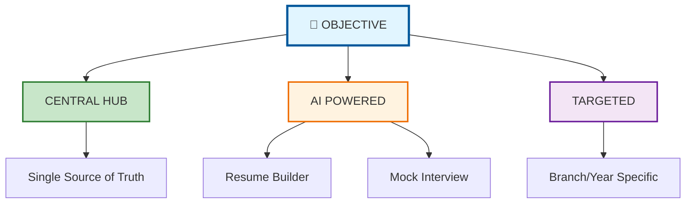

### Script
> "Our objective is three-fold:
> 1. **Centralize** — One platform, zero fragmentation
> 2. **Intelligentize** — AI-powered resume building and interview preparation
> 3. **Target** — Smart notifications by branch and year
>
> We built an ecosystem where the TnP cell becomes a **'Career Command Center'** and students get a **'Personal Career Assistant'**."

---

## 📊 SLIDE 4: System Architecture (The Backbone)

### Mermaid Diagram
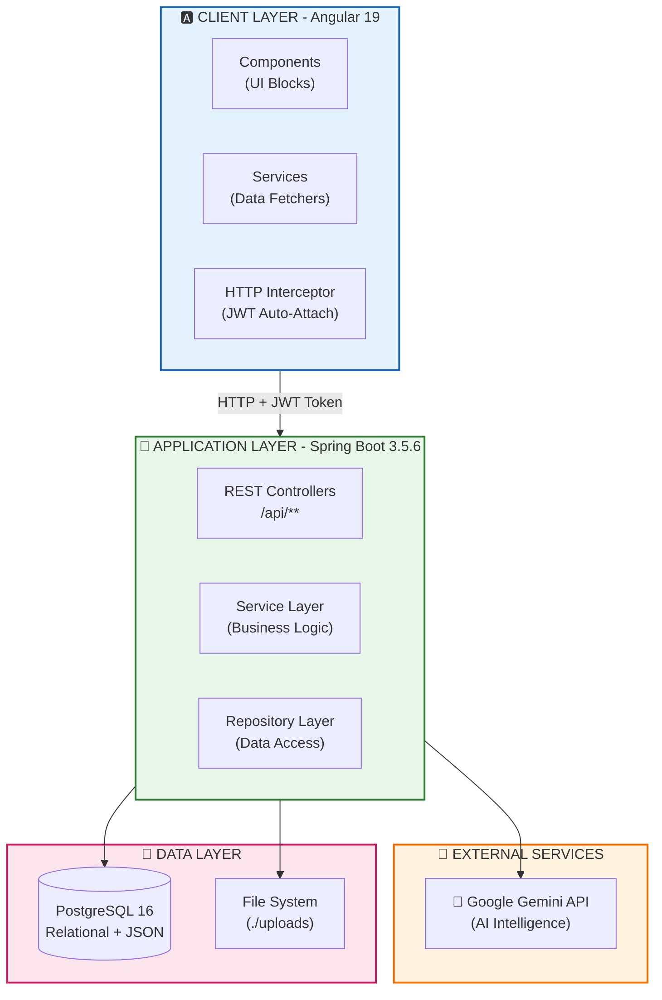

### Script
> "Our architecture follows **Enterprise 3-Tier Pattern**:
> 
> **Frontend:** Angular 19 Single Page Application. Key innovation — JWT HTTP Interceptor automatically attaches tokens to every request. No manual header management.
> 
> **Backend:** Spring Boot with Layered Architecture — Controllers handle HTTP, Services contain business logic, Repositories talk to database.
> 
> **External:** Google Gemini AI integrated via REST API for intelligent features.
> 
> The beauty? Each layer is independent. Change the database tomorrow, frontend won't even notice."

---

## 📊 SLIDE 5: ER Diagram (The "Campus Analogy")

### Mermaid Diagram
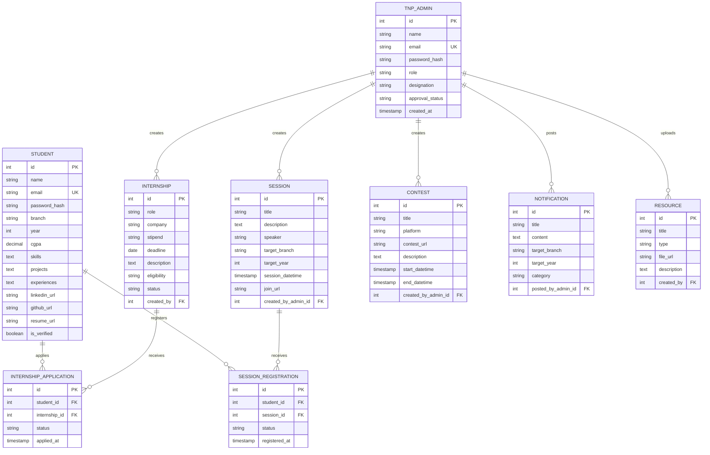

### Script
> "Instead of showing you traditional ER boxes, let me walk you through **'A Day in Our Digital Campus'**:
> 
> Imagine **Rahul**, a 3rd-year student. He logs in — that's our **Student entity**. He sees an internship at Google — that's the **Internship entity**. He applies — we create an **Internship_Application** record linking Rahul to Google.
> 
> Meanwhile, **Prof. Sharma** (Admin) posted that internship. She also creates a **Session** on 'Resume Building' — students **register** for it. She posts a **Contest** — students view it.
> 
> The genius? **Every relationship mirrors real-world interactions**. No complex joins, no confusion."

---

## 📊 SLIDE 6: Auth Module (The "Airport Security" Analogy)

### Mermaid Diagram
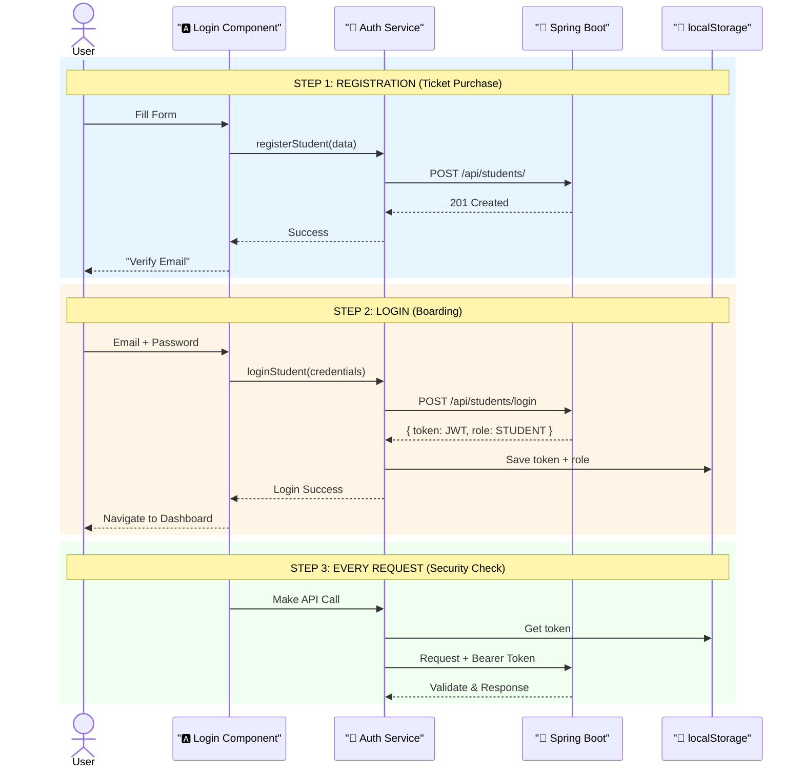

### Script
> "Let me explain our Auth Module using **Airport Security analogy**:
> 
> **Registration = Ticket Purchase:** You fill details, get verified via email (like ticket confirmation).
> 
> **Login = Boarding:** Show ID, get **Boarding Pass (JWT Token)**. This token contains your ID, role, and expiry — all cryptographically signed.
> 
> **Every API Call = Security Check:** Our HTTP Interceptor is like the security guard who checks your boarding pass before letting you enter. Token invalid? Immediately redirected to login.
> 
> **Special Case — Admins:** They need extra approval (like staff ID verification). Super Admin must approve before they can enter."

---

## 📊 SLIDE 7: Internship Module (The "Opportunity Pipeline")

### Mermaid Diagram
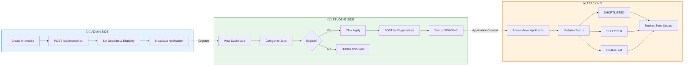

### Script
> "The Internship Module is our **Opportunity Pipeline**:
> 
> **Creation:** Admin posts job with deadline and targeting (only 3rd year COMP students see it).
> 
> **Discovery:** Student dashboard auto-categorizes — Active (can apply), Applied (already done), Closed (deadline passed).
> 
> **Application:** One-click apply creates a record linking Student ↔ Internship with 'PENDING' status.
> 
> **Tracking:** Admin sees all applicants, updates status (Shortlisted/Selected/Rejected). Student sees real-time updates.
> 
> **Innovation:** We don't just list jobs; we **contextualize** them based on eligibility and deadline."

---

## 📊 SLIDE 8: Session & Contest (The "Event Ecosystem")

### Mermaid Diagram
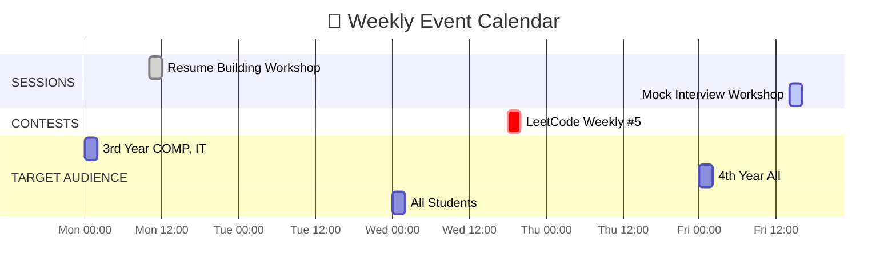

### Alternative Mermaid (Flowchart)
```mermaid
flowchart TB
    subgraph SESSION["🎓 SESSION MODULE"]
        S1[Admin Creates Session] --> S2[Set Target Branch/Year]
        S2 --> S3[Set Join URL]
        S3 --> S4[Students See Only If Match]
        S4 --> S5[Student Registers]
        S5 --> S6[POST /api/registrations]
    end

    subgraph CONTEST["🏆 CONTEST MODULE"]
        C1[Admin Posts Contest] --> C2[Add External Link]
        C2 --> C3[Set Time Window]
        C3 --> C4[All Students View]
        C4 --> C5[Click to External Arena]
    end

    style SESSION fill:#e3f2fd,stroke:#1565c0
    style CONTEST fill:#fff3e0,stroke:#ef6c00
```

### Script
> "Beyond internships, we manage the complete **Event Ecosystem**:
> 
> **Sessions:** Workshops, masterclasses with **targeted registration**. Only relevant students see them (3rd year COMP students don't get spammed with 1st year events).
> 
> **Contests:** Coding competitions with external arena links. We don't host the contest; we **curate and notify**.
> 
> **Key Difference:** Sessions require registration (we track attendance). Contests are just links (we don't track, only inform).
> 
> Both support smart targeting by branch and year — no information overload."

---

## 📊 SLIDE 9: AI Suite (The "Career GPS")

### Mermaid Diagram
```mermaid
flowchart LR
    A[👨‍🎓 STUDENT] --> B[🎯 CAREER GPS]
    B --> C[💼 Dream Job]

    subgraph AI["🤖 AI-POWERED FEATURES"]
        direction TB
        
        subgraph RESUME["ROUTE 1: Resume Optimization"]
            R1[Upload Resume] --> R2[AI Analyzes via Gemini]
            R2 --> R3[Optimized Resume + Suggestions]
        end

        subgraph INTERVIEW["ROUTE 2: Mock Interview"]
            I1[Enter Job Description] --> I2[Select Difficulty Level]
            I2 --> I3[AI Generates 5 Questions]
            I3 --> I4[You Answer]
            I4 --> I5[AI Evaluates 0-10 Score]
            I5 --> I6[Get Improvement Tips]
        end

        subgraph ROADMAP["ROUTE 3: Career Roadmap"]
            CR1[Target: Data Scientist] --> CR2[Month 1: Python, Pandas]
            CR2 --> CR3[Month 2: Machine Learning]
            CR3 --> CR4[Month 3: Deep Learning]
        end

        subgraph CHAT["24/7 CHATBOT"]
            CH1[Any Career Question] --> CH2[Instant AI Response]
        end
    end

    A --> AI --> C

    style AI fill:#f3e5f5,stroke:#6a1b9a,stroke-width:2px
    style RESUME fill:#e8f5e9,stroke:#2e7d32
    style INTERVIEW fill:#fff3e0,stroke:#ef6c00
    style ROADMAP fill:#e1f5ff,stroke:#01579b
    style CHAT fill:#fce4ec,stroke:#c2185b
```

### Script
> "Our **AI Career GPS** is what differentiates us from ordinary placement portals:
> 
> **Resume Optimizer:** Upload your resume, AI suggests improvements tailored to target role.
> 
> **Mock Interview:** Paste job description, select difficulty (Intro/Medium/Hard/HR/Stress). AI generates questions. You answer, AI evaluates (0-10 score) with improvement tips.
> 
> **Career Roadmap:** Tell AI your target role, get month-by-month learning plan with projects.
> 
> **24/7 Chatbot:** Any career question, instant answer.
> 
> **Backend:** Google Gemini API via REST. We parse JSON responses for structured data."

---

## 📊 SLIDE 10: API Matrix (The "Control Dashboard")

### Visual Table
```
┌────────────────────────────────────────────────────────────────────────────┐
│                        🎛️ API CONTROLLER MATRIX                            │
├────────────────────────────────────────────────────────────────────────────┤
│                                                                            │
│  CONTROLLER        │ BASE PATH          │ KEY ENDPOINTS                    │
│  (Java Class)      │ (URL Prefix)       │ (HTTP + Function)                │
├────────────────────┼────────────────────┼──────────────────────────────────┤
│                    │                    │                                  │
│  🟦 StudentCtrl    │ /api/students      │ POST /login        → JWT Token   │
│                    │                    │ POST /             → Register    │
│                    │                    │ PATCH /{id}        → Update      │
│                    │                    │ GET /{id}/full     → Profile     │
│                    │                    │ POST /{id}/resume  → Upload PDF  │
├────────────────────┼────────────────────┼──────────────────────────────────┤
│                    │                    │                                  │
│  🟩 AdminCtrl      │ /api/admins        │ POST /login        → JWT + Role  │
│                    │                    │ POST /register     → Create      │
│                    │                    │ PATCH /{id}/approve→ SuperAdmin  │
│                    │                    │ GET /pending       → View New    │
├────────────────────┼────────────────────┼──────────────────────────────────┤
│                    │                    │                                  │
│  🟨 InternshipCtrl │ /api/internships   │ GET /              → List All    │
│                    │                    │ POST /             → Create      │
│                    │                    │ GET /deadline      │ Filter     │
├────────────────────┼────────────────────┼──────────────────────────────────┤
│                    │                    │                                  │
│  🟥 ApplicationCtrl│ /api/applications  │ POST /             → Apply       │
│                    │                    │ GET /student/{id}  → My Apps     │
│                    │                    │ PUT /{id}          → Status Upd  │
├────────────────────┼────────────────────┼──────────────────────────────────┤
│                    │                    │                                  │
│  🟪 AI Controller  │ /api/ai            │ POST /resume/build → Optimize    │
│                    │                    │ POST /interview/q  → Questions   │
│                    │                    │ POST /roadmap      → Plan        │
│                    │                    │ POST /chat         → Chatbot     │
│                    │                    │ POST /shortlist/{id}→ AI Rank    │
├────────────────────┼────────────────────┼──────────────────────────────────┤
│                    │                    │                                  │
│  ⬜ SessionCtrl    │ /api/sessions      │ CRUD + Registration endpoints    │
│  ⬜ ContestCtrl    │ /api/contests      │ CRUD for competitions            │
│  ⬜ ResourceCtrl   │ /api/resources     │ File upload/download             │
│  ⬜ NotifyCtrl     │ /api/notifications │ Broadcast system                 │
│                                                                            │
└────────────────────────────────────────────────────────────────────────────┘

SECURITY: ALL paths (except login/register) require JWT in Header
          Authorization: Bearer <token>
```

### Script
> "This is our **API Control Dashboard**. We have 9 controllers handling 40+ endpoints.
> 
> **Color Coding:**
> - Blue: Student management
> - Green: Admin management  
> - Yellow: Internship operations
> - Red: Application lifecycle
> - Purple: AI features
> - Gray: Support modules
> 
> **Security Note:** Every single path (except login/register) requires JWT token. No backdoor access."

---

## 📊 SLIDE 11: Security Architecture (The "Token Journey")

### Mermaid Diagram
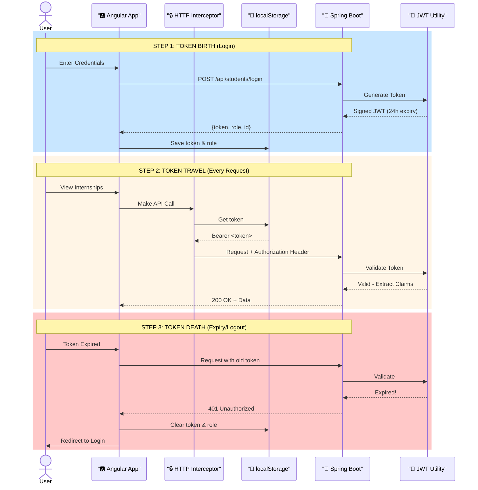

### Script
> "Security is not an afterthought; it's baked into every request.
> 
> **Token Journey:**
> 1. **Birth:** Successful login creates JWT with 24-hour expiry
> 2. **Storage:** Saved in browser's localStorage (survives page refresh)
> 3. **Travel:** HTTP Interceptor auto-attaches token to every request
> 4. **Death:** On expiry or logout, cleared and redirected
> 
> **Backend Validation:** Every request validates signature, checks expiry, extracts user identity. Tampered token? Immediately rejected."

---

## 📊 SLIDE 12: Implementation Highlights (Why We're Different)

### Mermaid Diagram
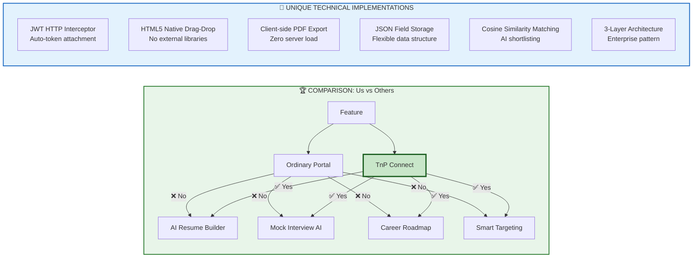

### Script
> "Here's why evaluators should remember our project:
> 
> **Feature Comparison:** While ordinary portals just list jobs, we provide **AI-powered career preparation**. Resume building, mock interviews, roadmaps — it's a complete career assistant.
> 
> **Smart Targeting:** No notification spam. A 1st year E&TC student never sees a 4th year COMP job.
> 
> **Technical Excellence:**
> - **Auto JWT Interceptor:** Zero manual token management
> - **Client-side PDF:** Resume downloads don't hit our server
> - **Native Drag-Drop:** No bulky libraries
> - **AI Shortlisting:** Automatic candidate ranking by resume-job match percentage
>
> This isn't just a portal; it's a **Placement Ecosystem**."

---

## 📊 SLIDE 13: Tech Stack (The "Power Tools")

### Mermaid Diagram
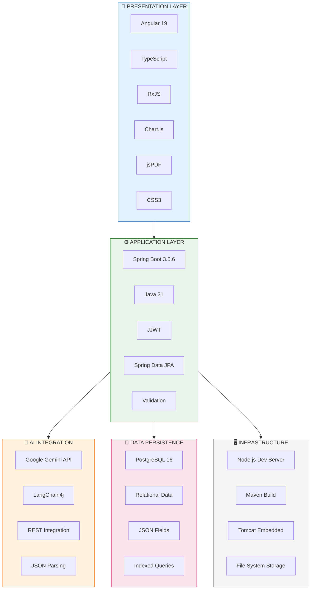

---

## 📊 SLIDE 14: Live Demo / Screenshots

### Visual Grid
```
┌──────────────────────────┬──────────────────────────┐
│    STUDENT DASHBOARD     │    AI RESUME BUILDER    │
│  [Screenshot 1]          │  [Screenshot 2]           │
│  • Active Internships    │  • Optimized Resume      │
│  • Applied Jobs List     │  • AI Suggestions        │
├──────────────────────────┼──────────────────────────┤
│    ADMIN DASHBOARD       │    MOCK INTERVIEW        │
│  [Screenshot 3]          │  [Screenshot 4]          │
│  • Post Internship       │  • AI Questions          │
│  • View Applicants       │  • Score Display         │
└──────────────────────────┴──────────────────────────┘

DEMO FLOW (2 minutes):
1. Login as Student → Show dashboard
2. Click AI Resume → Paste text → Show optimized output
3. Switch to Admin tab → Post internship
4. Back to Student → Show new internship
5. Apply → Show "Applied" status change
```

### Script
> "Let me show you this in action. [Switch to demo]
> 
> **As Student Rahul:** Login, see categorized internships, use AI resume optimizer.
> 
> **As Admin Prof. Sharma:** Post internship, see it instantly appear on student side.
> 
> **The Magic:** Real-time updates, AI suggestions in seconds, zero page reloads.
>
> [If live demo risky, use screenshots with arrows showing flow]"

---

## 📊 SLIDE 15: Impact & Future (The "Vision")

### Mermaid Diagram
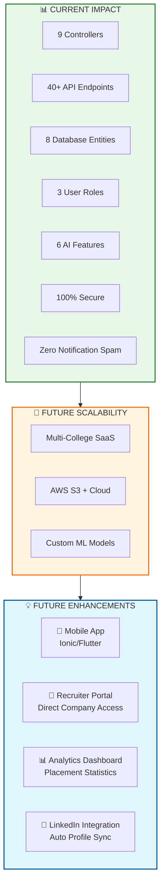

### Script
> "To conclude, TnP Connect transforms placement cells from **information silos to intelligent ecosystems**.
> 
> **Today:** 9 controllers, 40+ APIs, AI-powered preparation, zero spam.
> 
> **Tomorrow:** Multi-college SaaS platform with mobile apps, analytics, and recruiter portals.
> 
> Thank you. I'm ready for your questions."

---

## 🎭 DELIVERY TIPS FOR EVALUATORS

### Confidence Builders:

1. **Start Strong:** First 30 seconds set the tone. Speak slowly.

2. **Use Analogies:**
   - Architecture → "3-storey building"
   - JWT Token → "Boarding pass"
   - Interceptor → "Security guard"
   - Module → "College blocks"

3. **Pause Before Key Points:**
   > "And here's what makes us different... [pause] ...Artificial Intelligence."

4. **If You Don't Know:** 
   > "That's an excellent question. Let me think... [pause] ...Based on my understanding..."

5. **End with Invitation:**
   > "I'd be happy to show you the code or run a live demo if you'd like."

---

## ❓ Common Evaluator Questions (Be Ready)

| Question | Your Answer Strategy |
|----------|---------------------|
| "Why not React?" | Angular = Enterprise-grade, TypeScript, built-in solutions |
| "Is JWT secure?" | Yes, 24h expiry, auto-clear on logout, signature verification |
| "AI costs?" | Gemini API has generous free tier, scalable |
| "Database choice?" | PostgreSQL = ACID compliant, JSON fields for flexibility |
| "Your contribution?" | Frontend architecture, AI integration, Security layer |

---

## 📋 PRE-PRESENTATION CHECKLIST

- [ ] Slides copied to USB + Cloud backup
- [ ] Demo environment tested (login works)
- [ ] Screenshots ready (if live demo fails)
- [ ] Timer set (20 minutes max)
- [ ] Water bottle nearby
- [ ] Deep breath taken
- [ ] Smile ready 😊

**You've built something impressive. Now show them why.**

---

> **Final Tip:** Print the **API Matrix** (Slide 10) and **System Architecture** (Slide 4) on A4 paper. If you freeze, glance at them. They have all the information you need.

**Good luck! 🚀**
