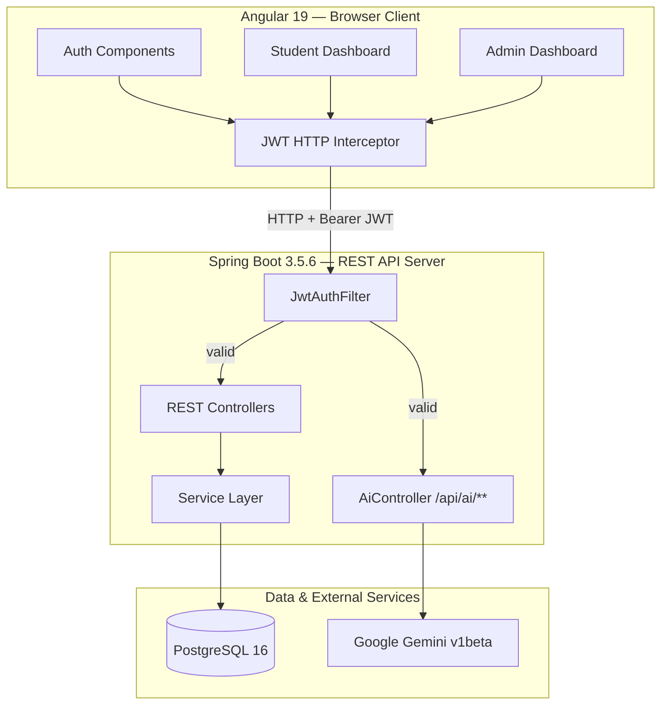
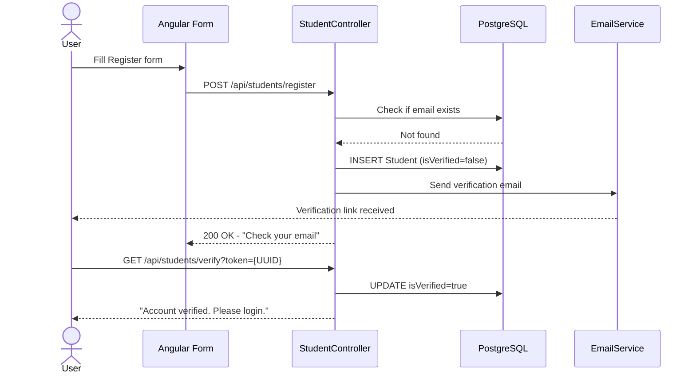
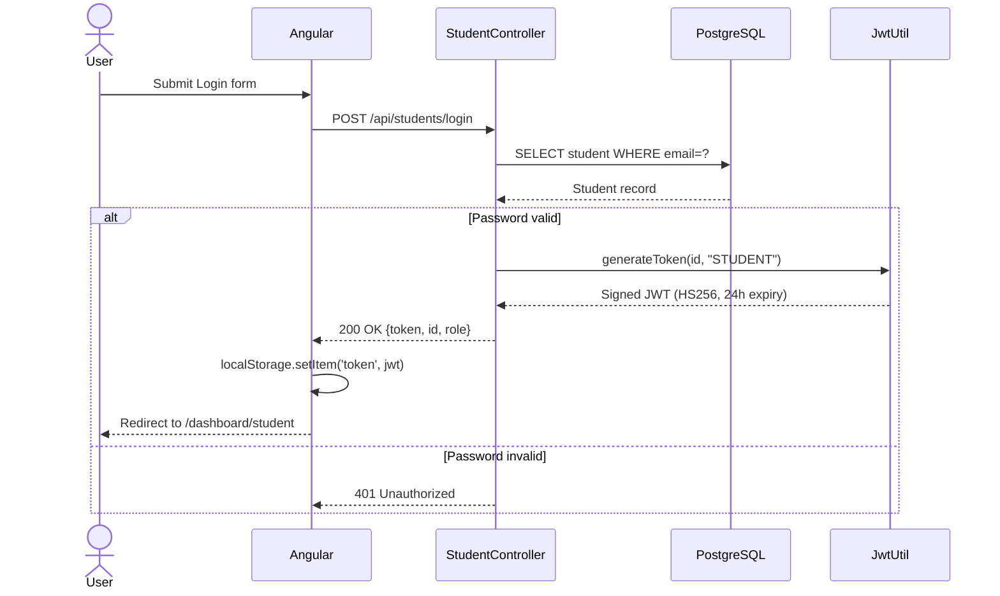
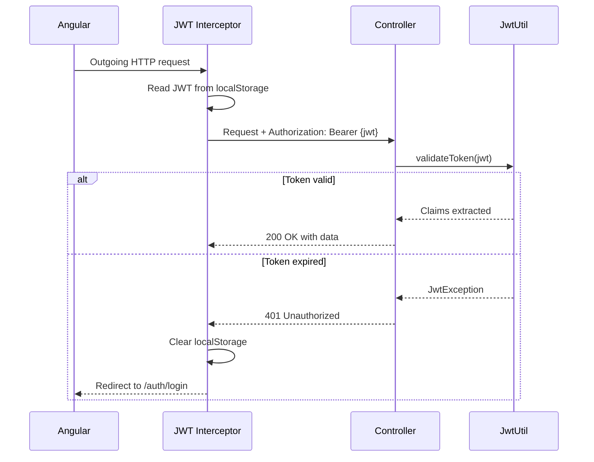
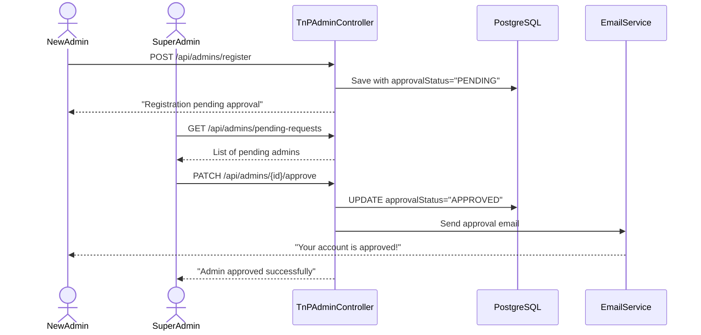
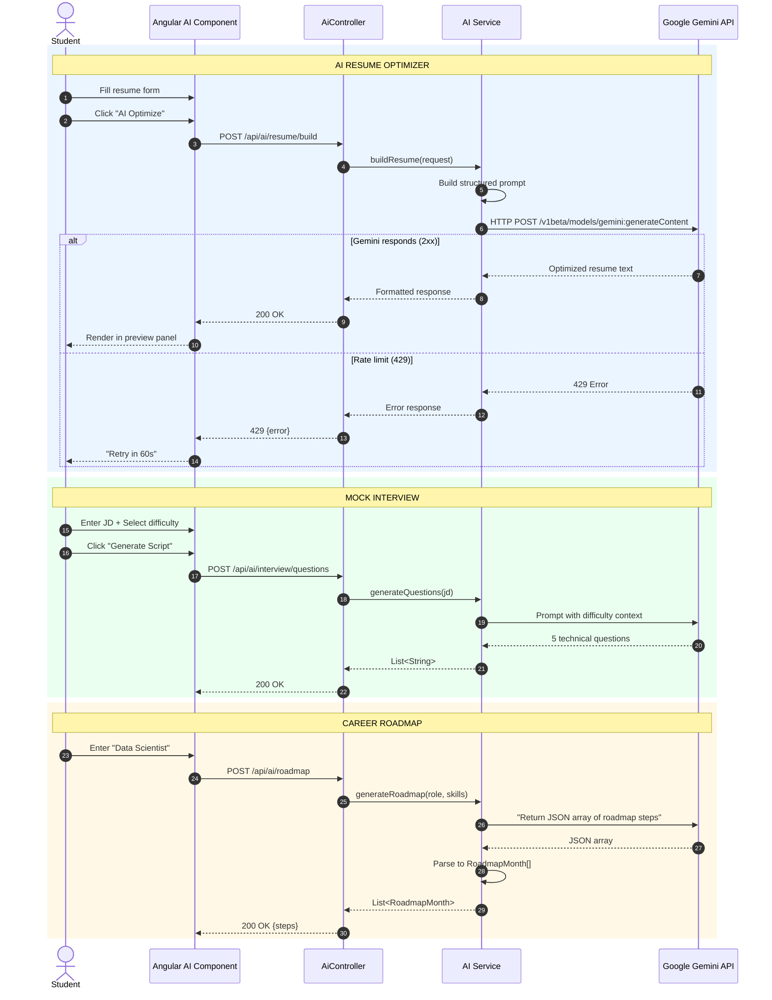
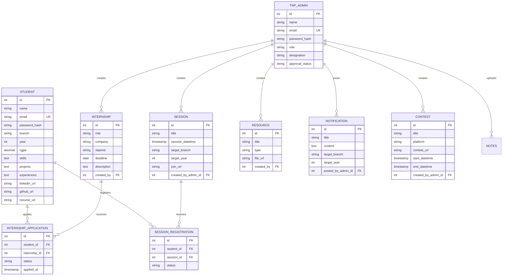

# TnP Connect — Complete Project Explanation Guide

> **Dual-Language Guide: Hinglish + English**  
> Comprehensive explanation from basics to advanced architecture

---

## TABLE OF CONTENTS

1. [Project Overview](#1-project-overview)
2. [System Architecture](#2-system-architecture)
3. [Authentication & Security](#3-authentication--security)
4. [User Management](#4-user-management)
5. [Internship Module](#5-internship-module)
6. [Session Module](#6-session-module)
7. [Contest Module](#7-contest-module)
8. [AI Features Suite](#8-ai-features-suite)
9. [Notification & Resource System](#9-notification--resource-system)
10. [Database Design](#10-database-design)

---

# 1. PROJECT OVERVIEW

## HINGLISH EXPLANATION

**TnP Connect kya hai?**

Ye ek **Training and Placement Cell Connectivity Platform** hai — matlab engineering colleges ke liye ek complete digital solution. Pehle colleges mein placement ki information WhatsApp pe broadcast hoti thi, Excel sheets mein track hoti thi, aur students deadlines miss kar dete the. 

**Problem kya thi?**
- Information scattered thi (WhatsApp, Email, Notice boards)
- Students ko pata nahi chalta tha ki kaunsi companies aa rahi hain
- Faculty ko real-time visibility nahi thi
- Recruiters ko unfiltered, unprepared applicants milte the

**Solution kya hai?**
TnP Connect ek **centralized, AI-driven ecosystem** hai jo poora placement lifecycle manage karta hai — from internship discovery to AI-powered resume building to mock interviews.

---

## ENGLISH EXPLANATION

**What is TnP Connect?**

It's a full-stack **Training and Placement Cell Connectivity Platform** for engineering institutions. It transforms fragmented placement processes (WhatsApp broadcasts, Excel sheets, email chains) into a unified, AI-driven command center.

**The Problem It Solves:**
- Fragmented communication across multiple channels
- Students missing critical deadlines
- Faculty lacking real-time visibility into placement activities
- Recruiters receiving unfiltered, unprepared candidates

**The Solution:**
A production-grade ecosystem unifying the entire placement lifecycle — internship discovery, session management, AI resume building, and mock interview preparation.

---

# 2. SYSTEM ARCHITECTURE

## HINGLISH EXPLANATION

**Architecture kaisa hai?**

3-layer architecture hai:

```
┌─────────────────────────────────────────┐
│    LAYER 1: ANGULAR 19 (Frontend)       │
│    - User interface browser mein run    │
│    - Components, Services, Guards       │
│    - JWT HTTP Interceptor har request mein│
│      token attach karta hai             │
└──────────────────┬──────────────────────┘
                   │ HTTP + Bearer JWT
┌──────────────────▼──────────────────────┐
│    LAYER 2: SPRING BOOT 3.5.6           │
│    - REST API server                    │
│    - Controllers handle HTTP requests   │
│    - Services mein business logic       │
│    - JWT Filter validate karta hai      │
└────────────┬───────────────┬─────────────┘
             │               │
    ┌────────▼────┐  ┌───────▼────────┐
    │  PostgreSQL │  │  Google Gemini  │
    │     16      │  │   (AI Model)    │
│    │ (Database)  │  │  via LangChain  │
    └─────────────┘  └────────────────┘
```

**Data Flow:**
1. User browser se Angular app mein kuch karta hai
2. Angular ka HTTP Interceptor JWT token attach karta hai har request mein
3. Request Spring Boot server pe jaati hai
4. JWT Filter check karta hai: token valid hai?
5. Valid hai to Controller → Service → Repository → Database
6. AI features ke liye Service Google Gemini API call karti hai

---

## ENGLISH EXPLANATION

**Architecture Overview:**

A 3-tier architecture following enterprise patterns:



**Key Architectural Decisions:**

| Decision | Rationale |
|----------|-----------|
| **JWT in localStorage** | SPA-compatible; AuthGuard + JwtInterceptor handle automatic injection |
| **LangChain4j over raw REST** | Structured output parsing, retry logic, prompt templating |
| **Experiences/Projects as JSON** | Avoids complex relational modeling for variable-length arrays |
| **Client-side PDF export** | Zero server load; jsPDF + html2canvas capture live preview |
| **HTML5 native Drag-and-Drop** | No external library dependency |

---

# 3. AUTHENTICATION & SECURITY

## HINGLISH EXPLANATION

**Authentication ka flow kaisa hai?**

**Step 1: Registration**
```
Student Form fill karta hai → POST /api/students/register
    ↓
Backend check karta hai: Email already exists?
    ↓
Nahi hai → Student save karta hai (password hashed)
    ↓
Verification email bhejta hai (UUID token ke saath)
    ↓
Email mein link click → Account verified
```

**Password Hashing kaise hota hai?**
```java
// Simple but effective
password.reverse() + ".TnP"
// "mypassword" → "drowssym.TnP"
```

**Step 2: Login**
```
Email + Password bhejta hai → POST /api/students/login
    ↓
Backend verify karta hai password hash
    ↓
Match hua → JWT Token generate hota hai
    ↓
Token mein hota hai: email, role (STUDENT/ADMIN), id
    ↓
Token 24 hours valid rehta hai
    ↓
Frontend token localStorage mein save karta hai
```

**Step 3: Protected Requests**
```
Har API call mein:
Header: Authorization: Bearer <JWT_TOKEN>
    ↓
Backend JWT validate karta hai signature + expiry
    ↓
Valid hai → Request process hoti hai
Invalid/Expired → 401 Unauthorized → Login page redirect
```

**Admin ka special case:**
Admin register karta hai → Status `PENDING` hota hai → Super Admin approve karta hai → Tab login allowed hota hai.

---

## ENGLISH EXPLANATION

### Complete Authentication Flow

**1. Registration with Email Verification**



**2. Login & JWT Issuance**



**3. Subsequent Authenticated Requests**



**Security Implementation:**

```java
// JwtUtil.java - Token Generation
@Component
public class JwtUtil {
    private final Key key = Keys.secretKeyFor(SignatureAlgorithm.HS256);
    private final long expirationTime = 86400000; // 24 hours

    public String generateToken(String email, String role, Integer id) {
        return Jwts.builder()
            .setSubject(email)
            .claim("role", role)
            .claim("id", id)
            .setIssuedAt(new Date())
            .setExpiration(new Date(System.currentTimeMillis() + expirationTime))
            .signWith(key)
            .compact();
    }
}
```

```typescript
// token.interceptor.ts - Frontend Token Attachment
@Injectable()
export class TokenInterceptor implements HttpInterceptor {
  intercept(request: HttpRequest<unknown>, next: HttpHandler): Observable<HttpEvent<unknown>> {
    const isWhitelisted = skipTokenUrls.some(url => request.url.includes(url));
    if (isWhitelisted) return next.handle(request);

    const token = localStorage.getItem('token');
    if (token) {
      request = request.clone({
        setHeaders: { Authorization: `Bearer ${token}` }
      });
    }
    
    return next.handle(request).pipe(
      catchError((error: HttpErrorResponse) => {
        if (error.status === 401) {
          localStorage.removeItem('token');
          localStorage.removeItem('userRole');
          this.router.navigate(['/']);
        }
        return throwError(() => error);
      })
    );
  }
}
```

---

# 4. USER MANAGEMENT

## HINGLISH EXPLANATION

**Do types ke users hain:**

### 1. Student
- Register kar sakta hai directly
- Email verify karna compulsory hai
- Profile mein yeh fields hain:
  - Basic: name, email, branch, year, CGPA
  - Skills: comma-separated string
  - Social: LinkedIn, GitHub URLs
  - Projects: JSON format (title, techStack, link, description)
  - Experiences: JSON format (role, company, duration, description)
  - Resume upload: PDF file

**Student Profile Update:**
```
PATCH /api/students/{id}
Body: { "phone": "9876543210", "linkedinUrl": "..." }
```
Partial update allowed hai — jo field bhejo wohi update hoti hai.

### 2. Admin (TnP Faculty)
- Register kar sakta hai but `PENDING` status mein jaata hai
- Super Admin (engineerindmind1209@gmail.com) approve karta hai
- Tabhi login allowed hota hai
- Approve hone pe email jaati hai

**Admin Powers:**
- Internship post karna
- Session schedule karna
- Contest create karna
- Notification broadcast karna
- Resources upload karna
- Student applications dekh sakta hai

---

## ENGLISH EXPLANATION

### User Roles & Permissions

**1. Student Entity Structure:**

```java
@Entity
@Table(name = "students")
public class Student {
    @Id @GeneratedValue private Integer id;
    private String name;
    @Column(unique = true) private String email;
    private String passwordHash;
    private String branch;
    private Integer year;
    private BigDecimal cgpa;
    
    // Stored as JSON strings for flexibility
    private String skills;       // "Java, Python, Spring Boot"
    private String projects;     // [{"title":"X", "techStack":"Y"}]
    private String experiences;  // [{"role":"Intern", "company":"Z"}]
    
    private String linkedinUrl;
    private String githubUrl;
    private String resumeUrl;
    
    @OneToMany(mappedBy = "student")
    private List<InternshipApplication> internshipApplications;
}
```

**2. Admin Approval Workflow:**



**3. Profile Management Endpoints:**

| Operation | Endpoint | Description |
|-----------|----------|-------------|
| Get Full Details | `GET /api/students/{id}/full-details` | Complete profile + applications |
| Partial Update | `PATCH /api/students/{id}` | Update specific fields |
| Upload Resume | `POST /api/students/{id}/upload-resume` | Multipart file upload |
| Search | `GET /api/students/search?branch=COMP&cgpa=8.0` | Filter students |

---

# 5. INTERNSHIP MODULE

## HINGLISH EXPLANATION

**Internship Module ka complete flow:**

### Admin Side — Internship Create Karna
```
Admin Dashboard → "New Drive" form fill karta hai
    ↓
POST /api/internships
Body: {
  company: "Google",
  role: "Software Engineer Intern",
  stipend: "50000",
  eligibility: "3rd year, CGPA > 8",
  deadline: "2024-12-31",
  description: "Full details..."
}
    ↓
Internship database mein save hoti hai (created_by = admin_id)
    ↓
Notification broadcast hoti hai targeted students ko
```

### Student Side — Internship Dekhna aur Apply Karna
```
Student Dashboard load hota hai
    ↓
GET /api/internships → Saari active internships fetch hoti hain
    ↓
Frontend categorize karta hai:
  - Active: Jisme deadline nahi gayi + apply nahi kiya
  - Closed: Deadline miss ho gayi
  - Applied: Already application submitted
    ↓
Student card expand karta hai → Full details + AI insights dikhte hain
    ↓
"Apply Now" click → POST /api/applications
    ↓
Duplicate check hota hai → Naya application save hota hai
    ↓
Card status change ho jaata hai "Applied"
```

### Application Status Tracking
```
Status values: PENDING → SHORTLISTED → SELECTED/REJECTED

Student apne dashboard mein dekh sakta hai:
- Kitni applications ki hai
- Har application ka current status
- Company name, role, apply date

Admin dekh sakta hai:
- Har internship ke kitne applicants hain
- Individual student profiles
- Status update kar sakta hai
```

---

## ENGLISH EXPLANATION

### Internship Lifecycle Architecture

```mermaid
sequenceDiagram
    autonumber
    actor Admin
    actor Student
    participant AngularAdmin as Admin Dashboard
    participant AngularStudent as Student Dashboard
    participant InternCtrl as InternshipController
    participant AppCtrl as ApplicationController
    participant DB as PostgreSQL

    rect rgb(230, 245, 255)
        Note over Admin, DB: ADMIN — POST INTERNSHIP
        Admin->>AngularAdmin: Fill "New Drive" form
        AngularAdmin->>InternCtrl: POST /api/internships + JWT
        InternCtrl->>InternCtrl: JWT filter validates Admin role
        InternCtrl->>DB: INSERT Internship (status=ACTIVE)
        DB-->>InternCtrl: Internship saved
        InternCtrl-->>AngularAdmin: 201 Created
        AngularAdmin-->>Admin: Success toast
    end

    rect rgb(240, 255, 240)
        Note over Student, DB: STUDENT — FETCH & APPLY
        Student->>AngularStudent: Opens "Internships" tab
        AngularStudent->>InternCtrl: GET /api/internships + JWT
        InternCtrl->>DB: SELECT * FROM internships
        DB-->>InternCtrl: List<InternshipResponse>
        InternCtrl-->>AngularStudent: 200 OK
        AngularStudent->>AngularStudent: categorize():
          active = filter(!applied && !missed)
          closed = filter(!applied && missed)
          applied = filter(applied)
        AngularStudent-->>Student: Render categorized grid

        Student->>AngularStudent: Click "Apply Now"
        
        alt Deadline passed
            AngularStudent-->>Student: Button disabled — "Closed"
        else Already applied
            AngularStudent-->>Student: Button disabled — "Applied"
        else Eligible
            AngularStudent->>AppCtrl: POST /api/applications
            AppCtrl->>DB: Check duplicate
            DB-->>AppCtrl: No duplicate
            AppCtrl->>DB: INSERT (status=PENDING)
            DB-->>AppCtrl: Application saved
            AppCtrl-->>AngularStudent: 201 Created
            AngularStudent->>AngularStudent: Update UI state
            AngularStudent-->>Student: Success toast
        end
    end

    rect rgb(255, 245, 230)
        Note over Admin, DB: ADMIN — MANAGE APPLICANTS
        Admin->>AngularAdmin: Click internship
        AngularAdmin->>AppCtrl: GET /api/applications/internship/{id}
        AppCtrl->>DB: SELECT applications JOIN students
        DB-->>AppCtrl: List<ApplicationSummary>
        AppCtrl-->>AngularAdmin: 200 OK
        Admin->>AngularAdmin: Update status
        AngularAdmin->>AppCtrl: PUT /api/applications/{id}
        AppCtrl->>DB: UPDATE status=?
        DB-->>AppCtrl: Updated
    end
```

**Internship Entity:**

```java
@Entity
@Table(name = "internships")
public class Internship {
    @Id @GeneratedValue private Integer id;
    private String role;
    private String company;
    private String stipend;
    private String eligibility;
    private LocalDate deadline;
    @Column(columnDefinition = "TEXT") private String description;
    private String status; // ACTIVE, CLOSED
    
    @ManyToOne
    @JoinColumn(name = "created_by")
    private TnPAdmin createdByAdmin;
    
    @OneToMany(mappedBy = "internship")
    private List<InternshipApplication> applications;
}
```

**Application Entity:**

```java
@Entity
@Table(name = "internship_applications")
public class InternshipApplication {
    @Id @GeneratedValue private Integer id;
    private String status; // PENDING, SHORTLISTED, SELECTED, REJECTED
    
    @CreationTimestamp
    private OffsetDateTime appliedAt;
    
    @ManyToOne
    @JoinColumn(name = "student_id")
    private Student student;
    
    @ManyToOne
    @JoinColumn(name = "internship_id")
    private Internship internship;
}
```

---

# 6. SESSION MODULE

## HINGLISH EXPLANATION

**Session Module ka kaam:**

TnP Cell placement sessions, masterclasses, aur workshops organize karta hai. Is module se:
- Admin session schedule kar sakta hai
- Students register kar sakte hain
- Targeting by branch/year ho sakti hai

### Session Create Karna (Admin)
```
POST /api/sessions
{
  title: "Resume Building Workshop",
  speaker: "John Doe",
  sessionDatetime: "2024-12-15T10:00:00Z",
  targetBranch: "COMP",  // "ALL" for everyone
  targetYear: 3,         // 0 for everyone
  joinUrl: "https://meet.google.com/...",
  description: "Learn to build ATS-friendly resumes"
}
```

### Session Registration (Student)
```
Student upcoming sessions dekhta hai
    ↓
Click "Register" → POST /api/registrations
    ↓
{ studentId: 1, sessionId: 5 }
    ↓
Registration save hoti hai with PENDING status
    ↓
Join URL access kar sakta hai
```

### Session vs Internship Difference
| Feature | Internship | Session |
|---------|------------|---------|
| Purpose | Job application | Workshop/Class |
| Output | Application status | Registration confirmation |
| Join URL | N/A | Join URL provided |
| Targeting | Eligibility criteria | Branch/Year specific |

---

## ENGLISH EXPLANATION

### Session Management System

**Session Entity:**

```java
@Entity
@Table(name = "sessions")
public class Session {
    @Id @GeneratedValue private Integer id;
    private String title;
    @Column(columnDefinition = "TEXT") private String description;
    private String speaker;
    private String targetBranch;  // "COMP", "IT", "ALL"
    private Integer targetYear;   // 1, 2, 3, 4, 0 (all years)
    
    @Column(name = "session_datetime")
    private OffsetDateTime sessionDatetime; // When it happens
    
    @Column(name = "join_url")
    private String joinUrl; // Google Meet/Zoom link
    
    @ManyToOne
    @JoinColumn(name = "created_by_admin_id")
    private TnPAdmin createdByAdmin;
    
    @OneToMany(mappedBy = "session")
    private List<SessionRegistration> registrations;
}
```

**Session Registration Entity:**

```java
@Entity
@Table(name = "session_registrations")
public class SessionRegistration {
    @Id @GeneratedValue private Integer id;
    private String status; // REGISTERED, ATTENDED, CANCELLED
    
    @CreationTimestamp
    private OffsetDateTime registeredAt;
    
    @ManyToOne
    @JoinColumn(name = "student_id")
    private Student student;
    
    @ManyToOne
    @JoinColumn(name = "session_id")
    private Session session;
}
```

**API Endpoints:**

| Endpoint | Method | Description |
|----------|--------|-------------|
| `/api/sessions/` | GET | List all sessions |
| `/api/sessions/` | POST | Create session (Admin only) |
| `/api/sessions/{id}` | DELETE | Cancel session |
| `/api/registrations/` | POST | Register for session |
| `/api/registrations/session/{id}` | GET | View registrations (Admin) |

---

# 7. CONTEST MODULE

## HINGLISH EXPLANATION

**Contest Module kya hai?**

Coding competitions ko manage karne ke liye. TnP Cell coding contests host karta hai:
- LeetCode contests
- HackerRank challenges
- College-specific coding rounds

### Contest Create Karna
```
POST /api/contests
{
  title: "Weekly Coding Challenge #5",
  platform: "LeetCode",
  contestUrl: "https://leetcode.com/contest/...",
  startDatetime: "2024-12-20T14:00:00Z",
  endDatetime: "2024-12-20T16:00:00Z",
  description: "DSA problems - Arrays, Trees, DP"
}
```

### Contest Display (Student Side)
```
Active Contests → End date nahi gayi
Closed Contests → End date past hai
Countdown timer dikhta hai
"Enter Arena" button → External link pe le jaata hai
```

### Key Fields
- **Platform**: LeetCode, HackerRank, CodeChef, etc.
- **Contest URL**: Direct link to contest page
- **Time window**: Start datetime → End datetime
- **Created by**: Which admin posted it

---

## ENGLISH EXPLANATION

### Contest Management System

**Contest Entity:**

```java
@Entity
@Table(name = "contests")
public class Contest {
    @Id @GeneratedValue private Integer id;
    private String title;
    private String platform; // LeetCode, HackerRank, etc.
    
    @Column(name = "contest_url")
    private String contestUrl; // External arena link
    
    @Column(name = "start_datetime")
    private OffsetDateTime startDatetime;
    
    @Column(name = "end_datetime")
    private OffsetDateTime endDatetime;
    
    @Column(columnDefinition = "TEXT")
    private String description;
    
    @ManyToOne
    @JoinColumn(name = "created_by_admin_id")
    private TnPAdmin createdByAdmin;
}
```

**Student Dashboard Contest View:**

```typescript
// Frontend categorization
activeContests = allContests.filter(c => new Date(c.endDatetime) > now);
closedContests = allContests.filter(c => new Date(c.endDatetime) <= now);

// Template display
<div *ngFor="let contest of activeContests">
  <span class="badge active">Active</span>
  <h3>{{ contest.title }}</h3>
  <p>Platform: {{ contest.platform }}</p>
  <countdown [target]="contest.endDatetime"></countdown>
  <a [href]="contest.contestUrl" target="_blank">Enter Arena</a>
</div>
```

---

# 8. AI FEATURES SUITE

## HINGLISH EXPLANATION

**AI Module ka introduction:**

TnP Connect mein **Google Gemini AI** integrated hai. Isse students ko smart assistance milti hai. Ye AI REST API ke through kaam karta hai (LangChain4j library use hoti hai wrapper ke liye).

### 1. AI Resume Builder
```
Student resume details enter karta hai:
- Role: "Software Engineer"
- Qualification: "B.Tech 3rd Year"
- Existing content: Current resume text
    ↓
POST /api/ai/resume/build
    ↓
Backend Gemini ko prompt bhejta hai:
"You are an expert resume writer... Optimize this resume"
    ↓
Gemini optimized resume return karta hai + suggestions
    ↓
Student preview dekh sakta hai → PDF export kar sakta hai
```

### 2. Mock Interview Generator
```
Student enter karta hai:
- Job Description: "Looking for Java developer..."
- Difficulty level: intro / medium / hard / hr / stress
    ↓
POST /api/ai/interview/questions
    ↓
Gemini generates 5 technical questions
    ↓
Student answer record kar sakta hai → Evaluation bhi AI karta hai
    ↓
Score (0-10) + Improvements list milti hai
```

### 3. Career Roadmap Generator
```
Target Role enter karta hai: "Data Scientist"
Current Skills: "Python, Statistics basics"
    ↓
POST /api/ai/roadmap
    ↓
Gemini returns JSON:
[
  { month: "Month 1", topics: ["Pandas", "NumPy"], projects: ["Sales Analysis"] },
  { month: "Month 2", topics: ["Machine Learning"], projects: ["House Price Prediction"] }
]
    ↓
Timeline cards mein display hota hai
```

### 4. AI Chatbot
```
Floating chatbot window (bottom-right corner)
Student kuch bhi pooch sakta hai:
- "How to prepare for Google interview?"
- "What skills needed for ML Engineer?"
- "Resume tips?"
    ↓
POST /api/ai/chat
    ↓
Gemini contextual answer deta hai
    ↓
Real-time chat interface mein display
```

### 5. AI-Powered Shortlisting
```
Admin ke paas internship hai → Bahut saare applicants hain
    ↓
POST /api/ai/shortlist/{internshipId}
    ↓
Backend har student ka resume parse karta hai (PDFBox)
    ↓
Resume content ko job description se compare karta hai
    ↓
Match percentage calculate hoti hai
    ↓
Ranked list return hoti hai → Top candidates dikhte hain
```

### AI Service Architecture
```
┌─────────────────────────────────────────┐
│  ChatbotService                         │
│  - Core Gemini API client               │
│  - promptGemini() method                │
│  - Rate limit handling (429 errors)     │
└────┬────────────────────────────────────┘
     │ Uses
┌────▼────────────────────────────────────┐
│  ResumeAiService                        │
│  InterviewService                       │
│  RoadmapService                       │
│  EmbeddingService                       │
└─────────────────────────────────────────┘
```

---

## ENGLISH EXPLANATION

### AI Intelligence Pipeline

**Architecture Overview:**



**Core AI Service Implementation:**

```java
@Service
public class ChatbotService {
    @Value("${ai.gemini.api-key}")
    private String apiKey;
    
    @Value("${ai.gemini.model:gemini-1.5-flash}")
    private String model;

    public String promptGemini(String prompt) {
        try {
            String url = "https://generativelanguage.googleapis.com/v1beta/models/" 
                       + model + ":generateContent?key=" + apiKey;
            
            Map<String, Object> payload = Map.of(
                "contents", List.of(Map.of("parts", List.of(Map.of("text", prompt))))
            );
            
            HttpHeaders headers = new HttpHeaders();
            headers.setContentType(MediaType.APPLICATION_JSON);
            HttpEntity<Map<String, Object>> entity = new HttpEntity<>(payload, headers);
            
            String response = restTemplate.postForObject(url, entity, String.class);
            
            // Extract text from Gemini response
            JsonNode root = objectMapper.readTree(response);
            JsonNode textNode = root.path("candidates").path(0)
                                 .path("content").path("parts").path(0).path("text");
            
            return textNode.asText()
                .replaceAll("(?s)```[a-zA-Z]*\\n?", "")
                .replace("```", "").trim();
                
        } catch (HttpClientErrorException.TooManyRequests ex) {
            return "API Rate Limit Exceeded. Please try again in 1 minute.";
        } catch (Exception ex) {
            return "AI Service temporarily unavailable: " + ex.getMessage();
        }
    }
}
```

**AI DTOs (Data Transfer Objects):**

```java
public class AiDtos {
    // Resume Builder
    public record ResumeBuildRequest(String role, String qualification, String existingContent) {}
    public record ResumeBuildResponse(String optimizedResume, List<String> suggestions) {}
    
    // Interview
    public record InterviewQuestionRequest(String jd) {}
    public record InterviewEvaluateRequest(String question, String transcript) {}
    public record InterviewEvaluateResponse(int score, List<String> improvements) {}
    
    // Roadmap
    public record RoadmapRequest(String targetRole, String currentSkills) {}
    public record RoadmapMonth(String month, List<String> topics, List<String> projects) {}
    
    // Chat
    public record ChatRequest(String query) {}
    public record ChatResponse(String answer) {}
    
    // Matching
    public record MatchResult(Integer internshipId, String company, String role, double score) {}
    public record ShortlistResult(Integer studentId, String studentName, double matchPercentage) {}
}
```

**AI Controller Endpoints:**

```java
@RestController
@RequestMapping("/api/ai")
public class AiController {
    
    @PostMapping("/interview/questions")
    public ResponseEntity<List<String>> generateQuestions(@RequestBody InterviewQuestionRequest request) {
        return ResponseEntity.ok(interviewService.generateQuestions(request.jd()));
    }

    @PostMapping("/interview/evaluate")
    public ResponseEntity<InterviewEvaluateResponse> evaluate(@RequestBody InterviewEvaluateRequest request) {
        return ResponseEntity.ok(interviewService.evaluateAnswer(request.question(), request.transcript()));
    }

    @PostMapping("/roadmap")
    public ResponseEntity<List<RoadmapMonth>> roadmap(@RequestBody RoadmapRequest request) {
        return ResponseEntity.ok(roadmapService.generateRoadmap(request.targetRole(), request.currentSkills()));
    }

    @PostMapping("/chat")
    public ResponseEntity<ChatResponse> chat(@RequestBody ChatRequest request) {
        return ResponseEntity.ok(new ChatResponse(chatbotService.answerWithPolicyContext(request.query())));
    }

    @PostMapping("/resume/build")
    public ResponseEntity<ResumeBuildResponse> buildResume(@RequestBody ResumeBuildRequest request) {
        return ResponseEntity.ok(resumeAiService.buildResume(request.role(), request.qualification(), request.existingContent()));
    }

    @PostMapping("/shortlist/{internshipId}")
    public ResponseEntity<List<ShortlistResult>> shortlist(@PathVariable Integer internshipId) {
        // Parse all applicant resumes and rank by JD similarity
        Internship internship = internshipRepository.findById(internshipId).orElseThrow();
        List<InternshipApplication> applications = applicationRepository.findByInternshipId(internshipId);
        
        List<ShortlistResult> ranked = applications.stream().map(app -> {
            File resumeFile = new File("uploads/resumes/" + app.getStudent().getId() + ".pdf");
            double score = 0;
            if (resumeFile.exists()) {
                try {
                    String resumeText = resumeParserService.extractText(resumeFile);
                    score = calculateSimilarity(resumeText, internship.getDescription());
                } catch (Exception ignored) {}
            }
            return new ShortlistResult(app.getStudent().getId(), app.getStudent().getName(), score);
        }).sorted(Comparator.comparingDouble(ShortlistResult::matchPercentage).reversed()).toList();
        
        return ResponseEntity.ok(ranked);
    }
}
```

---

# 9. NOTIFICATION & RESOURCE SYSTEM

## HINGLISH EXPLANATION

**Notification System:**

Admin broadcast kar sakta hai announcements specific branches/years ko:

```
POST /api/notifications
{
  title: "Google Drive Tomorrow!",
  content: "Be prepared with your resume...",
  targetBranch: "COMP",  // "ALL" for everyone
  targetYear: 4,         // 0 for everyone
  category: "URGENT",    // INFO, URGENT, EVENT
  link: "https://..."
}
```

Student dashboard mein:
- Sidebar mein notification count badge
- Notifications tab mein list with type badges
- Click karne se full content dikhta hai

**Resource Library:**

Admin study materials upload karta hai:
- Placement guides
- Previous year papers
- Company-specific preparation material
- Video links

```
Resource types:
- PDF: Direct file upload
- Link: External URL (YouTube, blogs, etc.)
```

---

## ENGLISH EXPLANATION

### Broadcast Systems

**Notification Entity:**

```java
@Entity
@Table(name = "notifications")
public class Notification {
    @Id @GeneratedValue private Integer id;
    private String title;
    @Column(columnDefinition = "TEXT") private String content;
    private String targetBranch; // "COMP", "IT", "ALL"
    private Integer targetYear;  // 1, 2, 3, 4, 0
    private String category;     // INFO, URGENT, EVENT
    private String link;         // Optional external link
    
    @ManyToOne
    @JoinColumn(name = "posted_by_admin_id")
    private TnPAdmin postedByAdmin;
}
```

**Resource Entity:**

```java
@Entity
@Table(name = "resources")
public class Resource {
    @Id @GeneratedValue private Integer id;
    private String title;
    private String type; // "PDF", "Link", "Video"
    @Column(name = "file_url") private String fileUrl;
    @Column(columnDefinition = "TEXT") private String description;
    
    @ManyToOne
    @JoinColumn(name = "created_by")
    private TnPAdmin createdByAdmin;
}
```

**Student-Side Filtering:**

```typescript
// Frontend filters notifications based on student's branch/year
myNotifications = allNotifications.filter(n => 
  (n.targetBranch === 'ALL' || n.targetBranch === this.studentData.branch) &&
  (n.targetYear === 0 || n.targetYear === this.studentData.year)
).sort((a, b) => new Date(b.createdAt).getTime() - new Date(a.createdAt).getTime());
```

---

# 10. DATABASE DESIGN

## HINGLISH EXPLANATION

**Database schema kaisa hai?**

PostgreSQL 16 use hota hai. Relationships:

```
students (1) ──────< (*) internship_applications >────── (*) internships
  │                                                              │
  │                                                              │
  └────< (*) session_registrations >────── (*) sessions          │
         │                                                     (1)
         │                                                    tnp_admins
         │
         └─────── (*) notes (created_by_admin)

notifications (*) ────── (1) tnp_admins
resources (*) ────────── (1) tnp_admins
contests (*) ─────────── (1) tnp_admins
```

**Key Relationships:**
- **Student** ke paas bahut **InternshipApplications** ho sakti hain
- **Internship** ke paas bahut **Applications** ho sakti hain
- **TnPAdmin** create karta hai: Internships, Sessions, Resources, Contests, Notifications

**JSON Fields ka use:**
- `projects`: Complex nested data as JSON string
- `experiences`: Array of objects as JSON
- `skills`: Comma-separated for easy searching

---

## ENGLISH EXPLANATION

### Entity Relationship Diagram



### Database Schema Summary

| Table | Purpose | Key Fields |
|-------|---------|------------|
| `students` | Student profiles | email (unique), branch, year, skills, projects (JSON), experiences (JSON) |
| `tnp_admins` | Admin accounts | email (unique), approval_status (PENDING/APPROVED) |
| `internships` | Job postings | company, role, deadline, created_by (FK) |
| `internship_applications` | Job applications | student_id (FK), internship_id (FK), status |
| `sessions` | Workshop events | session_datetime, target_branch, target_year |
| `session_registrations` | Event signups | student_id (FK), session_id (FK) |
| `contests` | Coding competitions | platform, contest_url, start/end datetime |
| `resources` | Study materials | type (PDF/Link), file_url |
| `notifications` | Broadcast alerts | target_branch, target_year, category |

---

# SUMMARY

## HINGLISH Summary

**TnP Connect ek complete placement ecosystem hai jo engineering colleges ke liye banaya gaya hai.**

**Main Components:**
1. **Authentication** — JWT-based secure login, email verification, admin approval
2. **Student Module** — Profile management, resume upload, skills tracking
3. **Internship Module** — Job discovery, applications, status tracking
4. **Session Module** — Workshop registration, targeted by branch/year
5. **Contest Module** — Coding competition announcements
6. **AI Suite** — Resume builder, interview prep, career roadmap, chatbot
7. **Broadcast System** — Targeted notifications and resource library

**Technology Stack:**
- Frontend: Angular 19 + Chart.js + jsPDF
- Backend: Spring Boot 3.5.6 + JJWT + Spring Data JPA
- AI: Google Gemini API via LangChain4j
- Database: PostgreSQL 16
- File Storage: Local filesystem (./uploads)

**Key Features:**
- Role-based access (Student vs Admin)
- Real-time deadline enforcement
- AI-powered resume optimization
- Mock interview with evaluation scoring
- Profile Constellation visualization
- Drag-and-drop resume builder

---

## ENGLISH Summary

**TnP Connect is a production-grade Training & Placement ecosystem for engineering institutions.**

**Core Architecture:**
- **Frontend:** Angular 19 SPA with JWT HTTP Interceptors, Chart.js visualizations, client-side PDF generation
- **Backend:** Spring Boot 3.5.6 REST API with JPA/Hibernate, layered architecture (Controller → Service → Repository)
- **AI Layer:** Google Gemini integration via LangChain4j for resume optimization, interview simulation, career roadmaps
- **Database:** PostgreSQL 16 with JSON fields for flexible data storage

**Key Capabilities:**
| Feature | Description |
|---------|-------------|
| Dual-Role System | Separate dashboards for Students and Admins with JWT-based access control |
| Internship Lifecycle | From posting → application → shortlisting → selection |
| AI Resume Builder | Multi-section editor with Gemini-powered optimization |
| Mock Interview | 5 difficulty levels with AI-generated questions and evaluation |
| Career Roadmap | Month-by-month skill and project planning |
| Profile Constellation | CSS-based 3D visualization of skills and achievements |
| Smart Shortlisting | AI ranking of applicants by resume-JD similarity |

**Design Decisions:**
- JSON strings for projects/experiences (flexibility over strict relations)
- Client-side PDF export (zero server load)
- HTML5 native Drag-and-Drop (no external dependencies)
- JWT in localStorage (SPA-optimized with automatic redirect on expiry)

---

*Document Reference: ARCHITECTURE.md | Codebase: RajRai77/T-P-Portal*
